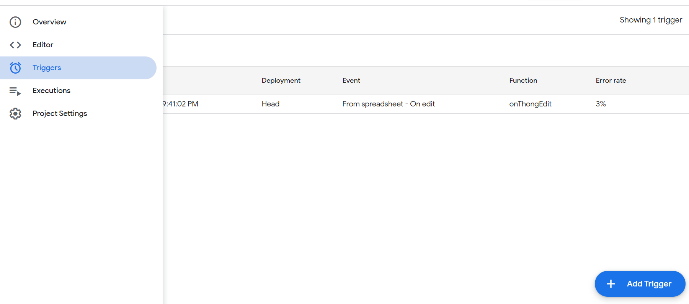
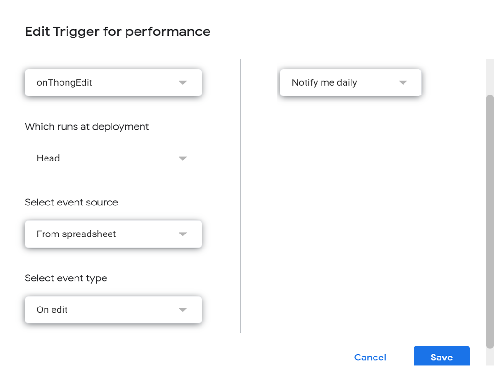

[Homepage](../README.md)

Example onEdit function in google app script.


Before you want to use onEdit function you must to trigger the sample trigger in app script or use Script.app to config it.


and then


```js
//This is example for 1 Cell change.
function onThongEdit(e) 
{
  //สร้างตัวแปรชื่อ sh และเก็บ ชื่อของ sheet ที่ชื่อว่า main ไว้ในตัวแปร
  const sh = e.range.getSheet()

  //ถ้า sheet ชื่อว่า main และมีการเปลี่ยนแปลงใน A1Notation ที่ช่อง F12 ให้ทำ Code ในเงื่อนไข if
  if(sh.getName() == "main" && e.range.getA1Notation() === 'F12')
  {
      let ss = SpreadsheetApp.getActiveSpreadsheet().getSheetByName('main')
      ss.getRange('F13').setValue("test") 
  }

  if(sh.getName() == "main" && e.range.getA1Notation() === 'F4')
  {
      temp_dev() 
  }

  if(sh.getName() == "main" && (e.range.getA1Notation() === 'B3' || e.range.getA1Notation() === 'D3' || e.range.getA1Notation() === 'H2') )
  {
      let ss = SpreadsheetApp.getActiveSpreadsheet().getSheetByName('main')
      let operating_weight = ss.getRange('B3').getValue()
      let pax_cargo = ss.getRange("D3").getValue()
      let fuel  = ss.getRange("H2").getValue()

      if (operating_weight + pax_cargo + fuel > 120000)
      {
        show_alert_MAX120()
      }  
  }
}

```


